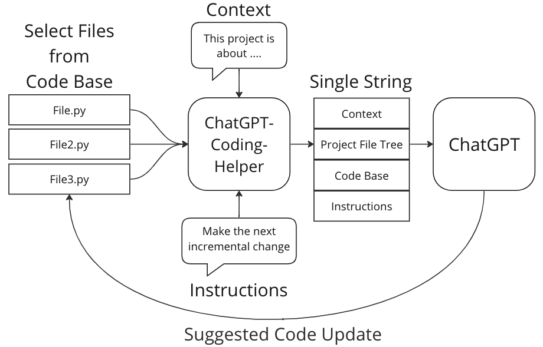
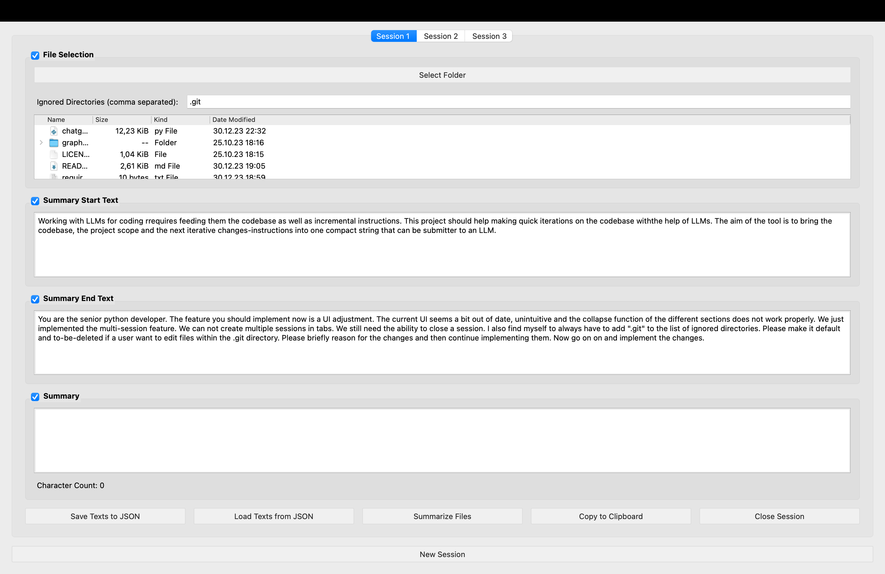

# ChatGPT-Coding-Helper



ChatGPT Coding Helper is a lightweight and user-friendly GUI tool that streamlines the process of working with large language models like ChatGPT for coding tasks. The tool allows users to select a directory, list its files (including subdirectories), and then choose multiple files from this list. Once the files are selected, the tool summarizes their contents into a single view, which makes iterative coding with ChatGPT even more efficient.

## Features

- **File Selection**: Easily browse and select files or entire folders for summarization.
- **File Summarization**: Aggregate content from multiple files into a single view. The summarized content follows a structure that includes the file path and its content.
- **Contextual Wrappers**: Add custom "start" and "end" texts to your summarized content, making it easier to provide context or instructions for coding tasks.
- **Clipboard Support**: Copy the summarized content directly to the clipboard with a single click.
- **Character Count**: Keep track of the summarized content's character count to ensure you stay within any text limit constraints.

## How to Use

1. **Select Folder**: Click on the "Select Folder" button to choose a directory. This will list all files and subdirectories in the directory.
2. **File Selection**: From the tree view, select multiple files or folders that you want to include in the summary.
3. **Optional Settings**:
   - **Ignored Directories**: Specify directories you want to ignore during summarization. Provide them as a comma-separated list.
   - **Start and End Text**: Enter optional text that will be added at the beginning and end of the summarized content.
4. **Generate Summary**: Click on the "Summarize Files" button to aggregate content from the selected files. The summarized content will be displayed below.
5. **Copy to Clipboard**: Click on the "Copy to Clipboard" button to copy the summarized content for your use.

## Prerequisites

To run ChatGPT Coding Helper, you need:

- Python 3.x
- PyQt5

You can install PyQt5 using pip:

```bash
pip install PyQt5
```

## Running the Tool
After ensuring you have the prerequisites, execute the script:

```bash
python chatgpt_coding_helper.py
```

## Contributing
Contributions, bug reports, and suggestions are welcome! Please open an issue or submit a pull request on GitHub.

## License
This project is open-source and available under the MIT License.

## Credits
Developed by [Jordi Spranger](https://github.com/JordiSpranger) with the assistance of OpenAI's ChatGPT.

## Screenshot

